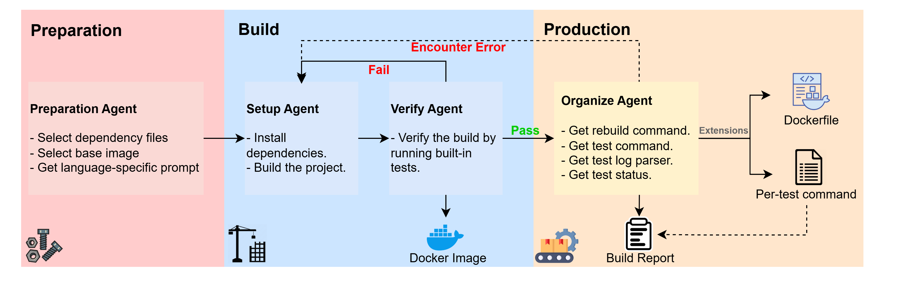
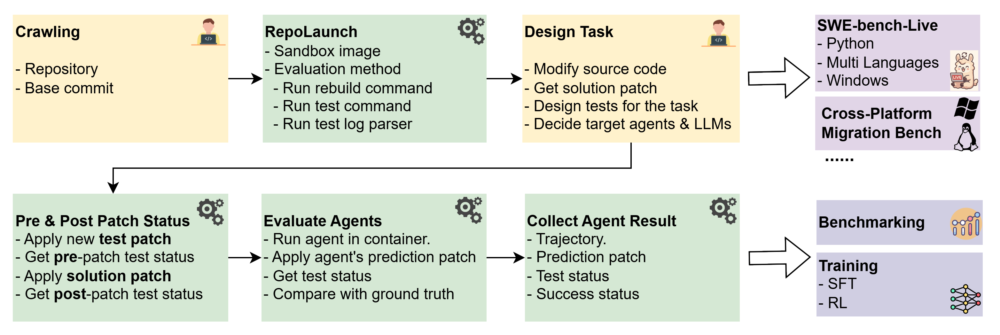

# `🚀 RepoLaunch Agent`

*Turning Any Codebase into Testable Sandbox Environment*

RepoLaunch now supports 
- All mainstram languages : C, C++, C#, Python, Java, Node.js (JS & TS), Go, Rust.
- Building on linux-arch & windows-arch docker images.

## Launch your Repository

To use RepoLaunch Agent to launch your repository, please refer to [Development.md](./docs/Development.md)

RepoLaunch can:
1) Install all dependencies and build the repository, delivered as a docker image;
2) Organize the command to rebuild the repository inside the container after modifications;
3) Organize command to test the repository and output testcase-status mapping, and optionally find per-testcase running command.

The basic workflow of RepoLaunch agent is as follows:




## Contributing

### Contributing to RepoLaunch Source Codes

Please refer to [CONTRIBUTING.md](./CONTRIBUTING.md).

### Use RepoLaunch for New Applications

So far the major contribution of RepoLaunch is to create tasks for [SWE-bench-Live](https://github.com/microsoft/SWE-bench-Live), where the creation of SWE-tasks is based purely on scraping GitHub issues and PRs. Now SWE-bench-Live datasets have been used for benchmarking of LLMs and coding agents, and training (SFT/RL) of coding LLMs. 

We encourage new research projects to design new kinds of SWE-tasks, with task creation automated by RepoLaunch.




## Citations

```bibtex
@article{zhang2025swebenchgoeslive,
  title={SWE-bench Goes Live!},
  author={Linghao Zhang and Shilin He and Chaoyun Zhang and Yu Kang and Bowen Li and Chengxing Xie and Junhao Wang and Maoquan Wang and Yufan Huang and Shengyu Fu and Elsie Nallipogu and Qingwei Lin and Yingnong Dang and Saravan Rajmohan and Dongmei Zhang},
  journal={arXiv preprint arXiv:2505.23419},
  year={2025}
}
```

## Trademarks

This project may contain trademarks or logos for projects, products, or services. Authorized use of Microsoft
trademarks or logos is subject to and must follow
[Microsoft's Trademark & Brand Guidelines](https://www.microsoft.com/legal/intellectualproperty/trademarks/usage/general).
Use of Microsoft trademarks or logos in modified versions of this project must not cause confusion or imply Microsoft sponsorship.
Any use of third-party trademarks or logos are subject to those third-party's policies.

