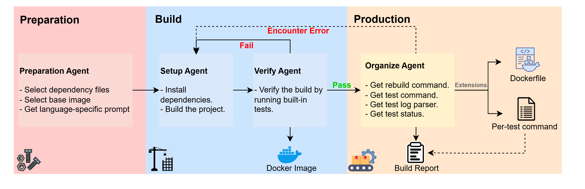
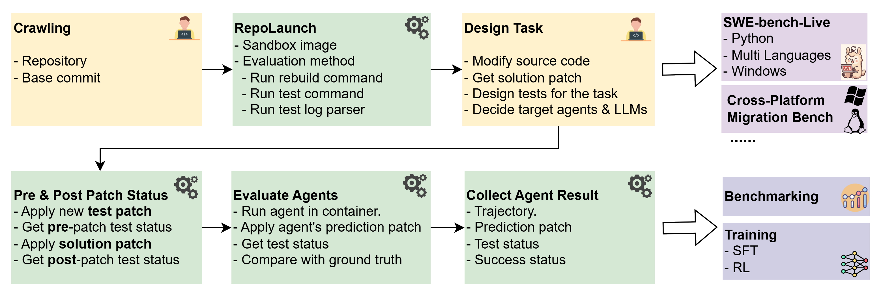

<h1 align="center"> 🚀 RepoLaunch Agent </h1>

<p align="center">
  <a href="https://arxiv.org/abs/2603.05026">
        
  </a>
  <a href="./LICENSE">
        
  </a>
</p>

<p align="center">
  <em>Turning Any Codebase into Testable Sandbox Environment</em>
</p>

RepoLaunch is the **first** agentic SWE tool for repository build and test management across programming languages and operating systems. Given a code repository, RepoLaunch can:
- Install all dependencies and build the repository, delivered as a docker image, with docker image layer info collected for Dockerfile reconstruction;
- Organize the command to rebuild the repository inside a container after repo modifications;
- Organize command to test the repository, write a parser to parse test output into structured testcase-status mapping, and optionally find per-testcase running command.

RepoLaunch now supports:
- All mainstram languages : C, C++, C#, Python, Java, Node.js (JS & TS), Go, Rust.
- Building on linux images, android images, windows images.

## Notifications

**[20/Aug/2026]** Proposed the memory-aware solution to reuse existing successful results of RepoLaunch to build&test the different commits of the same repo. See [Development.md](docs/Development.md#reuse-repolaunch-results-for-different-commits-of-the-same-repo). This solution is especially useful to create multiple task instances from different issues of the same repo. Experiments on building executable envs for 856 GitHub issues from 93 repos show >= 98% success, with 82% savings on LM API cost and 78% savings on Docker image storage space. 

**[28/Mar/2026]**

RepoLaunch now uses LiteLLM to:
  - ensure compatibility with all mainstream LLM providers
  - enable local LLM deployment for agentic training (RFT, RL) based on launch results

RepoLaunch now still uses traditional Thought-Action format for agent actions, because
  - We find that many smaller open-source LMs cannot handle tool call field well.
  - Thought Action in pure text content field ensures best compatibility and feasibility for smaller open-source LMs.

**[01/Mar/2026]** Thanks [GLM-5 Foundation Model](https://arxiv.org/pdf/2602.15763) for using RepoLaunch to create executable environment for agentic RL!

## Launch your Repository

To run RepoLaunch agent to launch your repository, please refer to [Development.md](./docs/Development.md).

Trajectory & result demos of RepoLaunch agent: [RepoLaunch-Trajectory-Archive](https://github.com/SWE-bench-Live/RepoLaunch-trajectory-archive).

The basic workflow of RepoLaunch agent is as follows:



## Contributing

### Contributing to RepoLaunch Source Codes

Please refer to [CONTRIBUTING.md::Contributing to RepoLaunch Source Codes](./CONTRIBUTING.md#contributing-to-repolaunch-source-codes).

### Use RepoLaunch to Create New Software Engineering Benchmarks

So far the major contribution of RepoLaunch is to build execution environment for [SWE-bench-Live](https://github.com/microsoft/SWE-bench-Live), where the creation of SWE-tasks is based purely on scraping GitHub issues and PRs. Now SWE-bench-Live datasets have been used for benchmarking of LLMs and coding agents, and agentic training (SFT/RL) of code LMs. 

We encourage new research projects to design new kinds of SWE-tasks for LLM benchmarking and training, with task creation automated by RepoLaunch.



### Improve Agentic Repository Build and Management Task based on RepoLaunch

Please refer to [CONTRIBUTING.md::Future Directions to Study](./CONTRIBUTING.md#future-directions-to-study).

## Citations

```bibtex
@article{li2026repolaunch,
  title={RepoLaunch: Automating Build and Management of Code Repositories across Languages and Platforms},
  author={Kenan Li and Rongzhi Li and Linghao Zhang and Qirui Jin and Liao Zhu and Xiaosong Huang and Geng Zhang and Yikai Zhang and Shilin He and Chengxing Xie and Xin Zhang and Zijian Jin and Bowen Li and Chaoyun Zhang and Yu Kang and Yufan Huang and Elsie Nallipogu and Saravan Rajmohan and Qingwei Lin and Dongmei Zhang},
  journal={arXiv preprint arXiv:2603.05026},
  year={2026}
}
```

## Trademarks

This project may contain trademarks or logos for projects, products, or services. Authorized use of Microsoft
trademarks or logos is subject to and must follow
[Microsoft's Trademark & Brand Guidelines](https://www.microsoft.com/legal/intellectualproperty/trademarks/usage/general).
Use of Microsoft trademarks or logos in modified versions of this project must not cause confusion or imply Microsoft sponsorship.
Any use of third-party trademarks or logos are subject to those third-party's policies.

