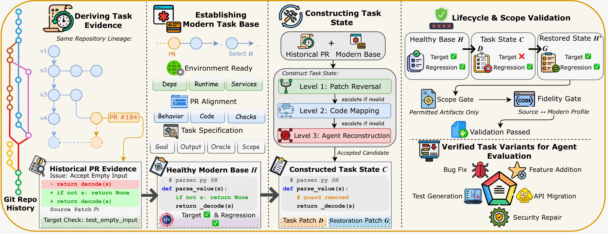

<div align="center">

# Change2Task

### From Repository Changes to Executable Coding-Agent Tasks

**Environment Engineering for Coding Agents · Chapter II**

<p>
  <a href="https://arxiv.org/abs/2607.28591">
    
  </a>
  <a href="https://github.com/microsoft/RepoLaunch/actions/workflows/ci.yml?query=branch%3Achange2task">
    
  </a>
  <a href="./data/v1">
    
  </a>
  
  <a href="./LICENSE">
    
  </a>
</p>

<p>
  Turn merged pull requests and repository evolution into grounded,
  executable tasks on healthy modern revisions.
</p>

</div>

<p align="center">
  
</p>

<p align="center">
  <sub>Change2Task workflow from the paper: historical evidence → modern base → L1/L2/L3 construction → H/C/R validation.</sub>
</p>

---

## Why Change2Task?

An executable coding-agent task is more than an issue description. It needs a
specific repository state, a realistic objective, development tools, protected
behavior, and a verifier that distinguishes success from plausible-looking
failure.

Change2Task treats repository history as reusable task evidence. It transfers a
historical maintenance change onto a runnable modern revision, constructs a
challenge state, and verifies the complete lifecycle:

```text
Healthy H  ──task patch──▶  Challenge C  ──restoration──▶  Restored H′
 target ✓                    target ✗                         target ✓
 regression ✓                regression ✓                     regression ✓
```

RepoLaunch established the first chapter of environment engineering: making
repositories buildable and testable. Change2Task is the sequel: obtaining more
verified coding-agent tasks from every maintained environment.

## What is included?

<table>
  <tr>
    <td width="33%" valign="top">
      <strong>Construction pipeline</strong><br>
      L1 Patch Reversal, L2 Code Mapping, and bounded L3 Agent Reconstruction
      behind one shared acceptance contract.
    </td>
    <td width="33%" valign="top">
      <strong>Five task families</strong><br>
      Bug Fix, Feature Addition, Test Generation, API Migration, and Security
      Repair.
    </td>
    <td width="33%" valign="top">
      <strong>Public task corpus</strong><br>
      900 provenance-linked task pairs from 252 public GitHub repositories and
      12 benchmark sources.
    </td>
  </tr>
  <tr>
    <td width="33%" valign="top">
      <strong>Strict validation</strong><br>
      Qualification, scope, fidelity, repeated H/C/R lifecycle, explicit
      infrastructure failures, and append-only evidence.
    </td>
    <td width="33%" valign="top">
      <strong>Agent-ready interface</strong><br>
      A typed Python API, the <code>change2task</code> CLI, project Skill,
      <code>AGENTS.md</code>, and one-command Skill installation.
    </td>
    <td width="33%" valign="top">
      <strong>Release hygiene</strong><br>
      Portable paths, privacy review, source provenance, pinned-base license
      inventory, strict schema, and complete checksums.
    </td>
  </tr>
</table>

## Install

### One-command setup: CLI + Agent Skill

```bash
curl -fsSL \
  https://raw.githubusercontent.com/microsoft/RepoLaunch/change2task/scripts/install.sh \
  | bash
```

This creates an isolated environment under `~/.local/share/change2task`, links
the CLI into `~/.local/bin`, and installs the Skill under
`~/.cursor/skills/change2task`. It does not require `sudo`.

### CLI and Python package

```bash
python -m pip install \
  "git+https://github.com/microsoft/RepoLaunch.git@change2task"
```

Verify:

```bash
change2task --help
```

### Clone the standalone branch

```bash
git clone --branch change2task --single-branch \
  https://github.com/microsoft/RepoLaunch.git Change2Task
cd Change2Task
python -m pip install -e ".[dev]"
```

## Install the Agent Skill

Install the Change2Task Skill into `~/.cursor/skills/change2task`:

```bash
curl -fsSL \
  https://raw.githubusercontent.com/microsoft/RepoLaunch/change2task/scripts/install_skill.sh \
  | bash
```

The repository also ships the project-local Skill at
[`.cursor/skills/change2task`](./.cursor/skills/change2task) and a generic
[`AGENTS.md`](./AGENTS.md), so compatible agents can discover the workflow
without copying instructions from the README.

Then ask an agent:

```text
Use the change2task skill to validate this TaskCase and construct it against
/path/to/repository. Keep the worktree isolated and report the accepted level
or explicit terminal failure.
```

## Quick start

### 1. Generate the strict input schema

```bash
change2task case-schema --output schemas/task-case.schema.json
```

### 2. Start from the synthetic example

```bash
cp examples/task_case.synthetic.json /tmp/my-case.json
```

Replace the placeholder repository, commits, historical patch, modern behavior
hosts, allowed paths, target checks, and regression checks.

### 3. Validate without executing repository commands

```bash
change2task validate-case /tmp/my-case.json
```

### 4. Construct and verify the task

```bash
change2task build-case /tmp/my-case.json \
  --repository-cache /path/to/repository \
  --output .change2task/outcome.json
```

The checkout must contain the exact `modern_commit` declared by the case.
Change2Task creates a detached case-specific worktree and removes it after the
run unless `--keep-worktree` is requested.

## Construction contract

### L1 · Patch Reversal

Reverse-apply the historical forward patch when it still maps cleanly onto the
modern revision.

### L2 · Code Mapping

Map a unique historical post-change block back to its pre-change behavior.
Ambiguous mappings and unsupported pure additions/deletions fail explicitly.

### L3 · Agent Reconstruction

Invoke a pluggable coding-agent backend only after deterministic routes fail.
The backend edits an isolated worktree and can receive structured feedback from
failed gates for at most four attempts.

### Shared gates

Every candidate, regardless of level, must pass:

1. clean patch application;
2. syntax/build qualification;
3. task-family scope and explicit allowed paths;
4. six-component source-to-modern fidelity;
5. repeated healthy/challenge/restored lifecycle validation.

No construction level receives a weaker acceptance definition.

## Public 900-pair corpus

The release lives in [`data/v1`](./data/v1):

```text
data/v1/
├── task_pairs/
│   ├── bug_fix.jsonl                 # 500
│   ├── feature_addition.jsonl        # 100
│   ├── test_generation.jsonl         # 100
│   ├── api_migration.jsonl           # 100
│   └── security_repair.jsonl         # 100
├── manifest.json
├── schema.json
├── sources.json
├── repository_licenses.json
├── AUDIT.md
├── THIRD_PARTY_NOTICES.md
└── CHECKSUMS.sha256
```

- **900/900 unique pair IDs**
- **252 public repository slugs**
- **12 public benchmark collections/releases**
- **860 embedded executable task records**
- **40 reference-only records gated by upstream licensing or redistribution
  terms**

The corpus contains task definitions only. It excludes agent answers,
solved/unsolved outcomes, model identities, prompts and responses, token usage,
timing, cost, CPU/RSS/disk telemetry, agreement statistics, RQ summaries,
receipts, and checkpoints.

Validate it:

```bash
python scripts/validate_public_dataset.py data/v1
(cd data/v1 && sha256sum -c CHECKSUMS.sha256)
```

Read the [dataset card](./data/v1/README.md),
[release audit](./data/v1/AUDIT.md), and
[third-party notices](./data/v1/THIRD_PARTY_NOTICES.md) before redistribution
or model training.

## Python API

```python
from pathlib import Path

from change2task.workflow.construction import CaseBuilder
from change2task.workflow.ledger import ConstructionLedger
from change2task.workflow.models import TaskCase

case = TaskCase.model_validate_json(Path("case.json").read_text())
ledger = ConstructionLedger(Path(".change2task/ledger"))

builder = CaseBuilder(
    repository_cache=Path("/path/to/repository"),
    worktrees_root=Path(".change2task/worktrees"),
    ledger=ledger,
)
```

Implement `ConstructionAgentBackend.run(...)` and pass it to `CaseBuilder` to
use a different L3 coding agent.

## Repository layout

```text
.
├── .cursor/skills/change2task/   # Auto-discoverable Agent Skill
├── .github/workflows/ci.yml      # Method, package, data, and Skill checks
├── assets/                       # Paper figure used in this README
├── data/v1/                      # Public 900-pair task corpus
├── docs/                         # Method, schema, provider, and security docs
├── examples/                     # Synthetic TaskCase
├── schemas/                      # Strict TaskCase JSON Schema
├── scripts/                      # Run, export, validate, and Skill utilities
├── src/change2task/              # Complete Change2Task implementation
├── tests/                        # Model-free local Git tests
├── AGENTS.md
├── CITATION.cff
├── Makefile
└── pyproject.toml
```

## Development

```bash
make install-dev
make validate
```

Public CI is model-free and network-free after dependency installation. Tests
use synthetic local Git repositories; the public corpus validator checks
schema, counts, hashes, patches, provenance, privacy gates, and license gates.

## Security

`TaskCase` is trusted executable input: it can declare commands and environment
variables. Run third-party cases in a disposable sandbox without production
credentials. Raw model I/O and command-output capture are disabled by default.

Read [Security and trusted inputs](./docs/security-and-trusted-inputs.md) before
running external cases.

## Citation

```bibtex
@article{qi2026change2task,
  title   = {Change2Task: From Repository Changes to Executable Coding Agent Tasks and Environments},
  author  = {Haomin Qi and Xingliang Wang and Xuanqi Gao and Baihui Sang and Xin Zhang and Minghua Ma and Pengfei Gao and Yu Kang and Qingwei Lin and Saravan Rajmohan and Dongmei Zhang and Qi Zhang},
  journal = {arXiv preprint arXiv:2607.28591},
  year    = {2026},
  url     = {https://arxiv.org/abs/2607.28591}
}
```

## License

Change2Task-authored code and metadata are released under the
[MIT License](./LICENSE). Third-party task material retains its benchmark and
upstream repository terms; see
[`data/v1/THIRD_PARTY_NOTICES.md`](./data/v1/THIRD_PARTY_NOTICES.md).
