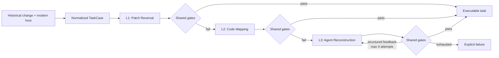

<h1 align="center">Change2Task</h1>

<p align="center">
  <strong>Environment Engineering for Coding Agents · Chapter II</strong>
</p>

<p align="center">
  <em>From repository changes to executable coding-agent tasks and environments</em>
</p>

<p align="center">
  <a href="https://arxiv.org/abs/2607.28591"></a>&nbsp;
  <a href="methods/change2task/README.md"></a>&nbsp;
  &nbsp;
  <a href="LICENSE"></a>
</p>

## The second chapter

RepoLaunch established the first chapter of environment engineering for coding
agents: make a real repository buildable, testable, and reusable. Change2Task is
the sequel. It starts from an executable repository environment and asks the
next question:

> How can repository evolution be converted into realistic, verifiable coding
> tasks on healthy modern revisions?

Change2Task turns historical software changes into task states, restoration
patches, and executable verification contracts. Its focus is not environment
bootstrapping; it is the systematic construction of grounded coding-agent work
inside environments that already run.

## What Change2Task produces

For each normalized historical change, Change2Task builds a paired lifecycle:

- **Healthy state (`H`)** — the pinned modern revision passes target and
  protected regression checks.
- **Challenge state (`C`)** — the reconstructed task condition causes target
  checks to fail while protected behavior remains intact.
- **Restored state (`R`)** — the restoration patch returns the repository to a
  passing state.

An accepted task includes:

- a task statement grounded in developer evidence;
- a minimal task-state patch;
- a forward restoration patch;
- explicit target and regression checks;
- scope, fidelity, qualification, and lifecycle evidence;
- append-only construction records with sensitive output capture disabled by
  default.

## Public task corpus

The release includes the paper's
[`900 paired task cases`](methods/change2task/data/v1):

- 500 Bug Fix pairs;
- 100 Feature Addition pairs;
- 100 Test Generation pairs;
- 100 API Migration pairs;
- 100 Security Repair pairs.

Every record contains the historical task provenance and the reconstructed
modern task definition. Local artifact paths have been materialized, task text
has been privacy-sanitized, and checksums cover the complete release.
Patch content is embedded for 860 records. Forty records remain reference-only
because of missing upstream licenses, Business Source License terms, or source
dataset redistribution restrictions.

The corpus contains task data only. It excludes coding-agent outputs,
solved/unsolved results, model identities, token usage, timing, cost, resource
telemetry, agreement statistics, and RQ summaries.

## Construction pipeline


```mermaid
flowchart LR
    A[Historical change + modern host] --> B[Normalized TaskCase]
    B --> C[L1: Patch Reversal]
    C --> G{Shared gates}
    G -->|pass| O[Executable task]
    G -->|fail| D[L2: Code Mapping]
    D --> H{Shared gates}
    H -->|pass| O
    H -->|fail| E[L3: Agent Reconstruction]
    E --> I{Shared gates}
    I -->|pass| O
    I -->|structured feedback<br/>max 4 attempts| E
    I -->|exhausted| X[Explicit failure]
```

### L1 — Patch Reversal

Reverse-apply the historical forward patch when it still maps cleanly to the
modern codebase.

### L2 — Code Mapping

Locate a unique historical post-change block in the modern revision and map it
back to its pre-change behavior. Ambiguous mappings fail explicitly.

### L3 — Agent Reconstruction

Use a pluggable coding-agent backend to reconstruct the unresolved maintenance
condition. Every retry receives structured feedback from the same gates used
for L1 and L2.

### Shared acceptance gates

Every candidate must pass the same sequence:

1. clean patch application;
2. syntax/build qualification;
3. task-family scope and allowed-path enforcement;
4. source-to-modern fidelity;
5. repeated `H → C → R` lifecycle validation.

Infrastructure errors, timeouts, unstable checks, empty patches, and exhausted
attempts remain explicit failures.

## Supported task families

- **Bug Fix** — reconstruct a historical defect on a modern host.
- **Feature Addition** — remove or disable a capability to create its
  implementation task.
- **Test Generation** — construct an observable implementation failure while
  keeping evaluation edits restricted to tests.
- **API Migration** — reintroduce obsolete usage that must be migrated.
- **Security Repair** — reconstruct vulnerable behavior under a bounded,
  executable oracle.

All five families share one construction core and define their own scope and
behavior contracts through adapters.

## Quick start

```bash
git clone --branch change2task https://github.com/microsoft/RepoLaunch.git
cd RepoLaunch/methods/change2task

python -m venv .venv
source .venv/bin/activate
python -m pip install -e ".[dev]"
cp .env.example .env
```

Generate the strict input schema:

```bash
change2task case-schema --output schemas/task-case.schema.json
```

Validate a normalized case without executing repository commands:

```bash
change2task validate-case examples/task_case.synthetic.json
```

Run the complete cascade against an existing checkout containing the pinned
modern commit:

```bash
change2task build-case path/to/case.json \
  --repository-cache /path/to/repository \
  --output .change2task/outcome.json
```

Claude Code is required only when a case reaches L3. The L3 backend is
replaceable through the public `ConstructionAgentBackend` protocol.

## Public interfaces

| Interface | Purpose |
|---|---|
| `change2task case-schema` | Emit the normalized `TaskCase` JSON Schema |
| `change2task validate-case` | Validate a case without running its commands |
| `change2task build-case` | Execute L1 → L2 → bounded L3 and all shared gates |
| `TaskCase` / `TaskFamily` | Strict Python input contracts |
| `CaseBuilder` | Programmatic construction orchestrator |
| `ConstructionAgentBackend` | Extension point for an L3 coding agent |

The release implementation lives in
[`methods/change2task`](methods/change2task).

## Documentation

- [Method and acceptance gates](methods/change2task/docs/method.md)
- [TaskCase input contract](methods/change2task/docs/task-case-schema.md)
- [L3 provider configuration](methods/change2task/docs/provider-configuration.md)
- [Security and trusted inputs](methods/change2task/docs/security-and-trusted-inputs.md)
- [Machine-readable TaskCase schema](methods/change2task/schemas/task-case.schema.json)
- [Public 900-pair task corpus](methods/change2task/data/v1)
- [Dataset provenance and license registry](methods/change2task/data/v1/sources.json)
- [Public-release privacy and integrity audit](methods/change2task/data/v1/AUDIT.md)

## Release scope

This branch publishes the reusable method implementation and the sanitized
900-pair public task corpus. It intentionally does **not** contain coding-agent
evaluation outputs, run directories, model transcripts, route receipts, token
logs, statistical summaries, paper tables, or internal operational state.

Public CI is model-free and network-free. Tests use synthetic local Git
repositories and exercise the CLI, deterministic construction, validation
gates, schema stability, and packaging.

## Security

`TaskCase` files are trusted executable input because they define commands.
Run third-party cases inside a disposable sandbox without production
credentials. Raw prompts, agent responses, stdout, and stderr are not persisted
unless explicitly enabled.

## Maintainer

[HarminChee](https://github.com/HarminChee)

## Citation

```bibtex
@article{qi2026change2task,
  title   = {Change2Task: From Repository Changes to Executable Coding Agent Tasks and Environments},
  author  = {Haomin Qi and Xingliang Wang and Xuanqi Gao and Baihui Sang and Xin Zhang and Minghua Ma and Pengfei Gao and Yu Kang and Qingwei Lin and Saravan Rajmohan and Dongmei Zhang and Qi Zhang},
  journal = {arXiv preprint arXiv:2607.28591},
  year    = {2026},
  url     = {https://arxiv.org/abs/2607.28591}
}
```

## License

MIT. See [LICENSE](LICENSE).
