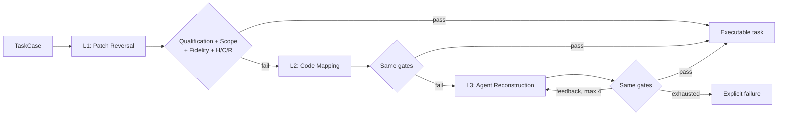

<h1 align="center">Change2Task Method Package</h1>

<p align="center">
  <strong>Executable task construction from repository evolution</strong>
</p>

<p align="center">
  <a href="https://arxiv.org/abs/2607.28591"></a>
  
  <a href="LICENSE"></a>
</p>

Change2Task is the second chapter of environment engineering for coding agents.
Where the first chapter made repositories executable, Change2Task turns their
evolution into grounded tasks with explicit challenge states, restoration
patches, and repeatable verification.

This package contains the reusable construction method only. No experiment
evaluation outputs, statistics, receipts, transcripts, or paper-production
data are included. The sanitized task-only corpus is released separately under
[`data/v1`](data/v1).

## Method at a glance



- **L1 Patch Reversal** reverse-applies historical maintenance evidence.
- **L2 Code Mapping** performs strict, unique-block semantic transplantation.
- **L3 Agent Reconstruction** uses a pluggable coding agent with bounded,
  gate-derived feedback.
- **H/C/R validation** requires target checks to pass/fail/pass and protected
  regression checks to pass throughout repeated runs.

The same acceptance gates apply at every construction level.

## Supported task families

Change2Task ships adapters for:

- Bug Fix
- Feature Addition
- Test Generation
- API Migration
- Security Repair

Each adapter defines a family-specific construction objective, evaluation
contract, and file-scope policy while sharing the same core pipeline.

## Requirements

- POSIX host
- Python 3.11 or newer
- Git
- a checked-out repository containing the pinned modern commit
- Claude Code only for cases that reach the bundled L3 backend

The L3 backend is replaceable; credentials stay in the caller's environment or
agent CLI.

## Install

```bash
cd methods/change2task
python -m venv .venv
source .venv/bin/activate
python -m pip install -e ".[dev]"
cp .env.example .env
```

## Public dataset

[`data/v1`](data/v1) contains 900 provenance-linked task pairs from 252 public
GitHub repositories. It includes task statements, pinned revisions, challenge
and restoration patches, test contracts, repository URLs, source collection
provenance, license notices, checksums, and a strict schema.

The release embeds executable patch content for 860 records. Forty records are
retained as reference-only task metadata because of missing upstream licenses,
Business Source License terms, or source dataset redistribution restrictions.

It does not include any agent-evaluation result, model output, token record,
runtime/cost telemetry, or RQ statistic.

Validate it with:

```bash
python scripts/validate_public_dataset.py data/v1
sha256sum -c data/v1/CHECKSUMS.sha256
```

## Prepare a case

Generate the strict JSON Schema:

```bash
change2task case-schema --output schemas/task-case.schema.json
```

Start from the synthetic template:

```bash
cp examples/task_case.synthetic.json /tmp/my-case.json
```

Replace all placeholder evidence, including:

- historical source patch and request;
- historical and modern commits;
- modern behavior hosts and allowed paths;
- target, regression, and optional qualification checks;
- task-family and source-to-modern symbol mapping.

Validate without executing:

```bash
change2task validate-case /tmp/my-case.json
```

## Build a task

```bash
change2task build-case /tmp/my-case.json \
  --repository-cache /path/to/repository \
  --output .change2task/outcome.json
```

The builder creates a detached, case-specific worktree at the exact modern
commit. It removes the worktree after completion unless `--keep-worktree` is
supplied.

The output root contains append-only construction tables and generated patch
artifacts. Raw prompts, model responses, stdout, and stderr remain disabled by
default.

## CLI

| Command | Purpose |
|---|---|
| `change2task case-schema` | Emit the complete `TaskCase` JSON Schema |
| `change2task validate-case` | Parse and validate a case without execution |
| `change2task build-case` | Run the full construction and validation cascade |

Convenience scripts:

```bash
./scripts/generate_schema.sh
./scripts/run_case.sh CASE_JSON REPOSITORY_CHECKOUT [OUTPUT_ROOT]
```

## Python API

```python
from pathlib import Path

from pr_injector.workflow.construction import CaseBuilder
from pr_injector.workflow.ledger import ConstructionLedger
from pr_injector.workflow.models import TaskCase

case = TaskCase.model_validate_json(Path("case.json").read_text())
ledger = ConstructionLedger(Path(".change2task/ledger"))
builder = CaseBuilder(
    repository_cache=Path("/path/to/repository"),
    worktrees_root=Path(".change2task/worktrees"),
    ledger=ledger,
)
```

Implement `ConstructionAgentBackend.run(...)` and pass the backend to
`CaseBuilder` to use a different L3 coding agent.

## Configuration

Runtime settings use the `CHANGE2TASK_*` prefix:

```dotenv
CHANGE2TASK_L3_MODEL=claude-opus-4.8
CHANGE2TASK_L3_EXECUTABLE=claude
CHANGE2TASK_L3_PERMISSION_MODE=acceptEdits
CHANGE2TASK_L3_TIMEOUT_SECONDS=1800
CHANGE2TASK_L3_MAX_ATTEMPTS=4
CHANGE2TASK_LIFECYCLE_REPEAT_COUNT=2
CHANGE2TASK_RUN_ROOT=.change2task
CHANGE2TASK_CAPTURE_AGENT_IO=false
CHANGE2TASK_CAPTURE_COMMAND_OUTPUT=false
```

See [provider configuration](docs/provider-configuration.md) for backend details.

## Documentation

- [Construction method](docs/method.md)
- [TaskCase contract](docs/task-case-schema.md)
- [Provider configuration](docs/provider-configuration.md)
- [Security and trusted inputs](docs/security-and-trusted-inputs.md)
- [Public 900-pair task corpus](data/v1)
- [Dataset release audit](data/v1/AUDIT.md)
- [Project overview](../../README.md)

## Security and privacy

`TaskCase` files are trusted executable input: checks may execute arbitrary
commands. Use disposable sandboxes, pin the modern commit, avoid production
credentials, and review third-party manifests before execution.

Check environment values are redacted in the persisted case record. Enabling
raw agent or command-output capture is an explicit privacy decision.

## Development

```bash
python -m pytest -q
python -m ruff check .
```

CI does not invoke models or external repositories. Tests use synthetic local
Git histories.

## Maintainer

[HarminChee](https://github.com/HarminChee)

## Citation

```bibtex
@article{qi2026change2task,
  title   = {Change2Task: From Repository Changes to Executable Coding Agent Tasks and Environments},
  author  = {Haomin Qi and Xingliang Wang and Xuanqi Gao and Baihui Sang and Xin Zhang and Minghua Ma and Pengfei Gao and Yu Kang and Qingwei Lin and Saravan Rajmohan and Dongmei Zhang and Qi Zhang},
  journal = {arXiv preprint arXiv:2607.28591},
  year    = {2026},
  url     = {https://arxiv.org/abs/2607.28591}
}
```

## License

MIT. See [LICENSE](LICENSE).
